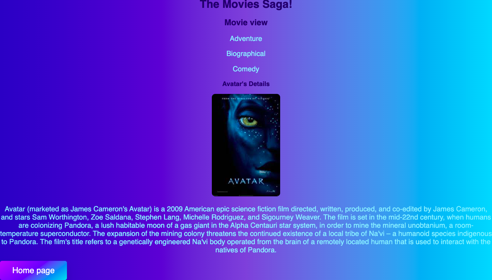

# Movie Sagas

## Description
Duration: 10 hours

This App is able to display movies to the user. When you click on the movie image or title box the user will have the ability to see the movie details/description and the movie's genre.

## Prerequisites

 npm install,
 npm run server, 
 npm run client,

 ## Screenshots

## Acknowledgements
Thanks to Prime Digital Academy who equipped and helped me to make this application a reality. Thanks to my instructor, Liz and my supportive classmates in the Jemisin cohort.

## Support
If you have any questions or comments, please email me at [miskiali222@gmail.com]

